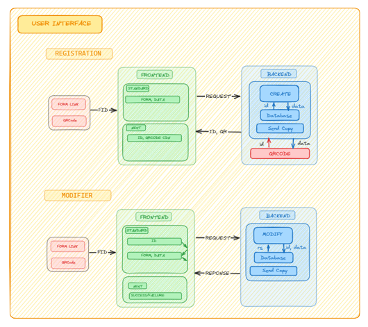
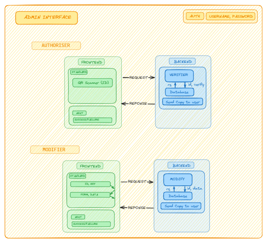

# Sankalp

Sankalp is a user-friendly registration form application. This intuitive and efficient tool streamlines the registration process, allowing individuals to easily sign up for SOSC events and hackathons. With Sankalp SOSC can collect essential participant information seamlessly, ensuring a smoother and more organized registration experience for both users and administrators.

## Workflow

  
  

## Contributors

## Maintainers

  <svg xmlns="http://www.w3.org/2000/svg" xmlns:xlink="http://www.w3.org/1999/xlink" width="200" height="80" viewBox="0 0 132 64">
    <a href="https://github.com/HeimanPictures" >
      <svg x="0" y="0" width="64" height="64">
        <title>Akkil M G</title>
        <circle cx="32" cy="32" r="32" stroke="#c0c0c0" stroke-width="1" fill="url(#fill0)"/>
        <defs>
          <pattern id="fill0" x="0" y="0" width="64" height="64" patternUnits="userSpaceOnUse">
            <image x="0" y="0" width="64" height="64" xlink:href="https://avatars.githubusercontent.com/u/78695802?v=4"/>
          </pattern>
        </defs>
      </svg>
    </a>
    <a href="https://github.com/Deveesh-Shetty" >
      <svg x="68" y="0" width="64" height="64">
        <title>Deveesh Shetty</title>
        <circle cx="32" cy="32" r="32" stroke="#c0c0c0" stroke-width="1" fill="url(#fill1)"/>
        <defs>
          <pattern id="fill1" x="0" y="0" width="64" height="64" patternUnits="userSpaceOnUse">
            <image x="0" y="0" width="64" height="64" xlink:href="https://avatars.githubusercontent.com/u/89470104?v=4"/>
          </pattern>
        </defs>
      </svg>
    </a>
  </svg>

